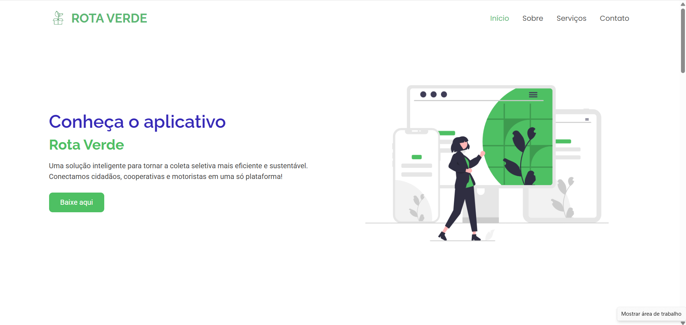
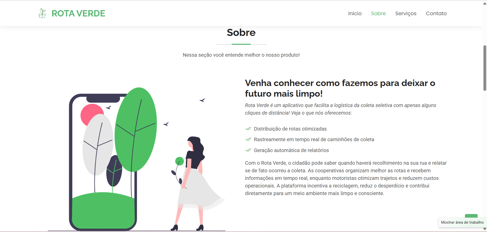
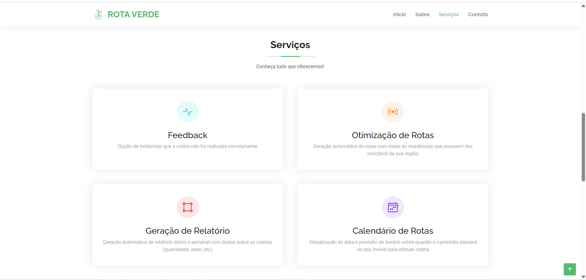
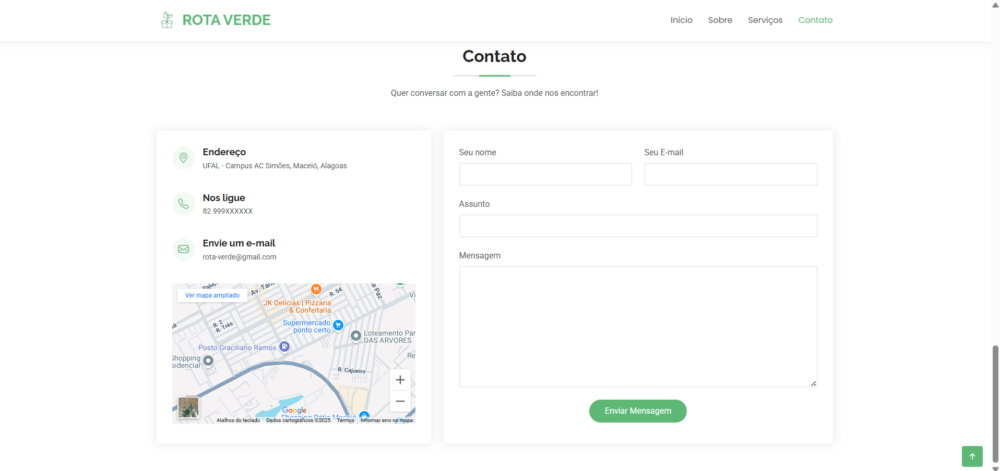
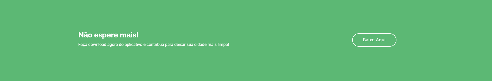
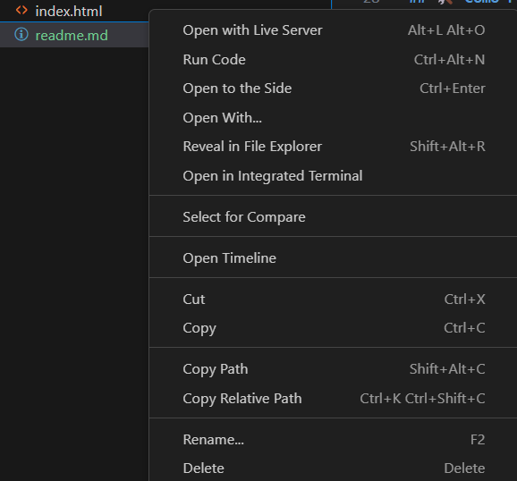

# Landing Page - App Rota Verde


Landing Page criada para apresentar o aplicativo "Rota Verde" e permitir que o usuário faça download dele.

---

## ✅ Tecnologias Utilizadas

- [HTML](https://developer.mozilla.org/pt-BR/docs/Web/HTML)
- [Bootstrap](https://getbootstrap.com/)
- [VS CODE](https://code.visualstudio.com/)
- [Live Server](https://marketplace.visualstudio.com/items?itemName=ritwickdey.LiveServer)


---

## 🔍 Visual

Segue o resultado final de como ficou a LP:

 
 


---

## 💻 Como clonar
Para clonar este repositório na sua máquina, é só usar o comando no seu terminal:

```
git clone https://github.com/laravitoriabarros/LandingPage-RotaVerde.git
```

---

## 🛠️ Como rodar

Tenha instalada no seu VS Code a extensão "Live Server". Depois, navegue até a pasta do projeto, clique com botão direito em cima do arquivo "index.html", e escolha a opção "Open with Live Server", dessa forma a landing page será aberta no seu navegador.


